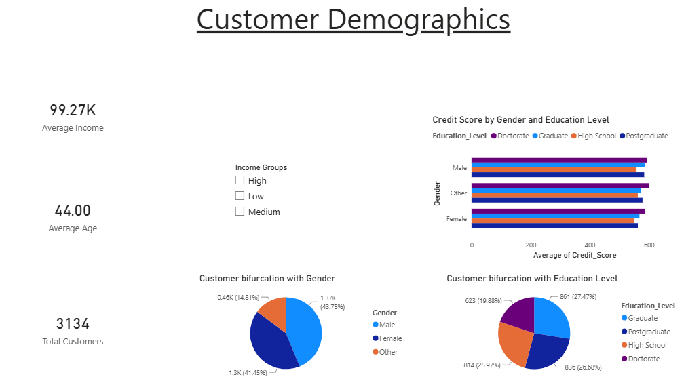
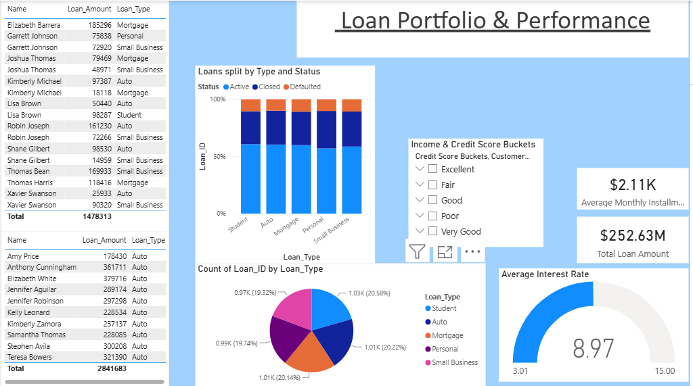
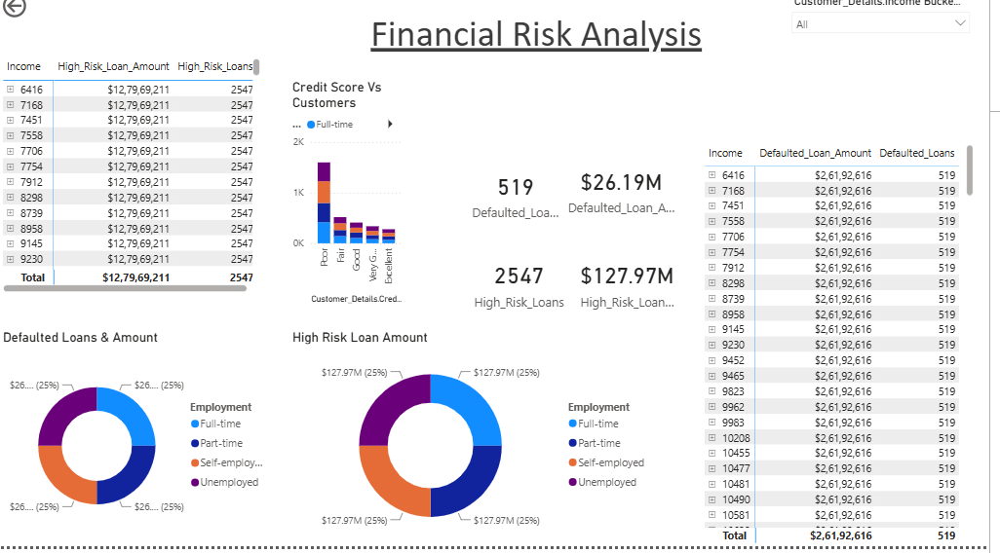

# Finance Loan Analysis Dashboard | Power BI

This project analyzes financial data from a loan service provider using Microsoft Power BI. The objective is to understand customer demographics, evaluate loan portfolio performance, identify high-risk customers, and provide insights that help improve lending decisions.

# Dataset Information

| Table            | Description                             |
| ---------------- | --------------------------------------- |
| Customer_Details | Customer demographic information        |
| Loan_Details     | Loan transactions and repayment details |

# Project Workflow

Connect to Excel Dataset
Power Query
Data Cleaning
Data Categorization
Data Modeling
DAX Measures
Interactive Dashboard
Business Insights

# Data Cleaning

Removed duplicate records.
Removed missing values.
Corrected data types.
Renamed tables.
Standardized column names.
Created date table.
Validated relationships.

# Data Transformation

**Age Group**
| Age   | Group       |
| ----- | ----------- |
| <=25  | Young       |
| 26–45 | Middle-aged |
| 46–58 | Senior      |
| >=59  | Elder       |

**Income Bucket**
| Income   | Group  |
| -------- | ------ |
| <50k     | Low    |
| 50k-110k | Medium |
| >110k    | Senior |

**Credit Score Bucket**
| Credit    | Group     |
| ----------|---------- |
| <= 579    | Poor      |
| 580 - 669 | Fair      |
| 670 - 739 | Good      |
| 740 - 799 | Very Good |
| >= 800    | Excellent |

# Dashboard

# Customer Demographics

---

# Loan Portfolio

---

# Financial Risk Analysis

